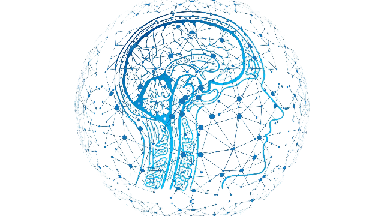

<!-- PROJECT LOGO -->
<br>
<p align="center">
  <a href="https://github.com/enriquetomasmb/bci-tfg">
    
  </a>
  <h3 align="center">Brain-Computer Interface Project</h3>

  <p align="center">
    Framework for P300 wave detection and noise-based cyberattacks in Brain-Computer Interfaces
    <br>
    Noise-based Cyberattacks Generating Fake P300 Waves in Brain-Computer Interfaces
    <br>
  </p>
</p>

## About the project

<a href="https://um.es">
  
</a>
<br>
Implementation of a framework for EEG signal acquisition from a BCI, signal processing, and P300 detection using trained classifiers. Besides, it deploys a scenario where P300 evoked potentials are generated through the Oddball paradigm and visual stimuli.<br>
This project is part of the End of Degree Project in Computer Engineering at the University of Murcia.
<br><br>

This repository contains a related code for the paper *[Noise-based cyberattacks generating fake P300 waves in brain–computer interfaces](https://doi.org/10.1007/s10586-021-03326-z)*.


### Prerequisites

* Python version 3.7 or more, pyenv recommended
* pip3

### Installation

1. Clone the repo
```sh
git clone https://github.com/enriquetomasmb/bci-tfg.git
```
With ```--branch develop``` you will get the developing branch.
```sh
git clone --branch develop https://github.com/enriquetomasmb/bci-tfg.git
```
2. Change to project directory
3. (Optional) Create your virtual environment, and activate it (you can also use ```conda``` to create the virtual environment)
```sh
python -m venv env

source env/bin/activate  # Linux/Mac
env/Scripts/activate  # Windows
```
3. Install required packages
```sh
pip3 install -r requirements.txt
```
4. Enter your API in `main.py`
```python
API = ''

```
API used in Mode 2 (automatic mode) to obtain random images in experiments

See the [API documentation](https://unsplash.com/documentation) for more information on how to get your own API.

## Usage

### ```main.py```

This file is the core of the implementation performed. The user who created the experiment will only have to run this script with the appropriate parameters for optimum performance.
The possibility to vary the parameters allows to have a more dynamic and adjusted experiment.

Run ```main.py```
```sh
python main.py
```

Optional arguments: 

| Parameter                 | Default       | Description   |	
| :------------------------ |:-------------:| :-------------|
| -n --name 	       |	exp_{datetime}           |Name of the experiment
| -dim --dim 	       |	\[1920,1080]           |Size Monitor
| -dm --distmon 	       |	67           |Distance to the monitor (cm)
| -m --mode 	       |	2           |Program execution mode
| -i --images 	       |	30           |Number of different images used in the experiment
| -p --prob 	       |	0.1           |Probability of appearance of the target in the experiment (per unit)
| -tt 	       |	5           | Target display time (seconds)
| -in 	       |	0.250           |Elapsed time between images (seconds)
| -io 	       |	0.150           |Offset time of each image (seconds)
| -j 	       |	0.2           |Variable jitter time when displaying image (seconds)
| -v --version 	       |	           |Version of the program
| -a --about 	       |	           |Program developer information
| -h --help 	       |	           |Help on using the program


### ```signal_analysis.ipynb```

In this Jupyter Notebook you will find all the analysis and processing of the EEG signal.
This EEG signal is obtained by running the ```main.py``` alongside the OpenBCI brain-machine interface.

It also includes the detection of the P300 evoked potential, as well as classification processes to determine its presence.
Finally, adversarial attack techniques using signal noise are applied. This demonstrates the possibility of the P300 wave disappearing or being attenuated.

All explanations can be found in the file ```signal_analysis.ipynb```

For more information, see the research in the TFG document.

## Tools

* [OpenBCI Cyton](https://openbci.com/) - EEG Recording
* [Python](https://www.python.org/) - Python and the libraries for the creation of the experiment and EEG signal synchronization


## Roadmap

See the [open issues](https://github.com/enriquetomasmb/bci-tfg/issues) for a list of proposed features (as well as known issues).


## Author

* **Enrique Tomás Martínez Beltrán** - [Website](https://enriquetomasmb.com) - [LinkedIn](https://www.linkedin.com/in/enrique-tomas/)

## Citation

If you use this repository, please cite our [paper](https://doi.org/10.1007/s10586-021-03326-z):

```
@article{MartinezBeltran:2021,
  author={Mart{\'i}nez Beltr{\'a}n, Enrique Tom{\'a}s
  and Quiles P{\'e}rez, Mario
  and L{\'o}pez Bernal, Sergio
  and Huertas Celdr{\'a}n, Alberto
  and Mart{\'i}nez P{\'e}rez, Gregorio},
  title={Noise-based cyberattacks generating fake P300 waves in brain--computer interfaces},
  journal={Cluster Computing},
  year={2021},
  month={Jul},
  day={10},
  abstract={Most of the current Brain--Computer Interfaces (BCIs) application scenarios use electroencephalographic signals (EEG) containing the subject's information. It means that if EEG were maliciously manipulated, the proper functioning of BCI frameworks could be at risk. Unfortunately, it happens in frameworks sensitive to noise-based cyberattacks, and more efforts are needed to measure the impact of these attacks. This work presents and analyzes the impact of four noise-based cyberattacks attempting to generate fake P300 waves in two different phases of a BCI framework. A set of experiments show that the greater the attacker's knowledge regarding the P300 waves, processes, and data of the BCI framework, the higher the attack impact. In this sense, the attacker with less knowledge impacts 1{\%} in the acquisition phase and 4{\%} in the processing phase, while the attacker with the most knowledge impacts 22{\%} and 74{\%}, respectively.},
  issn={1573-7543},
  doi={10.1007/s10586-021-03326-z},
}
```
## License

This project is licensed under the MIT License - see the [LICENSE](LICENSE) file for details

